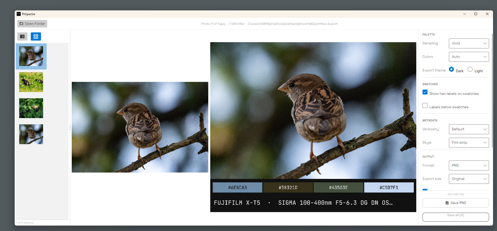
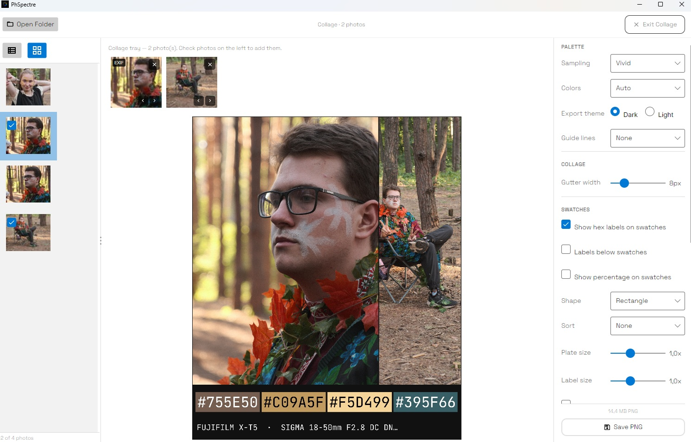
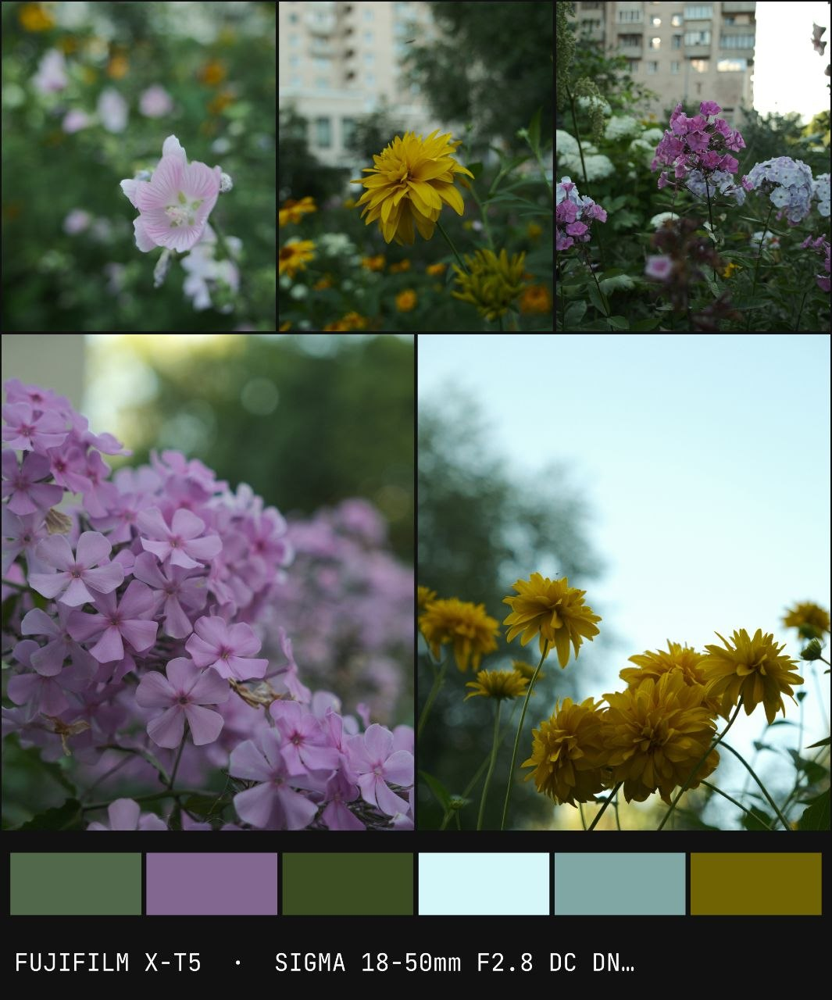
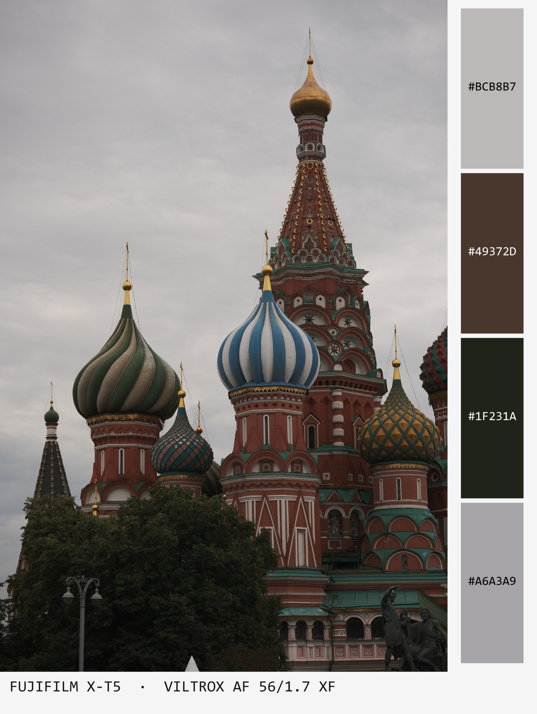
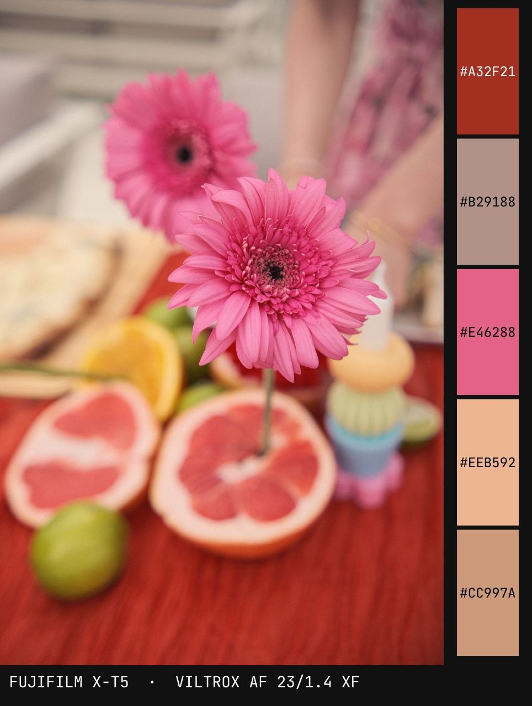
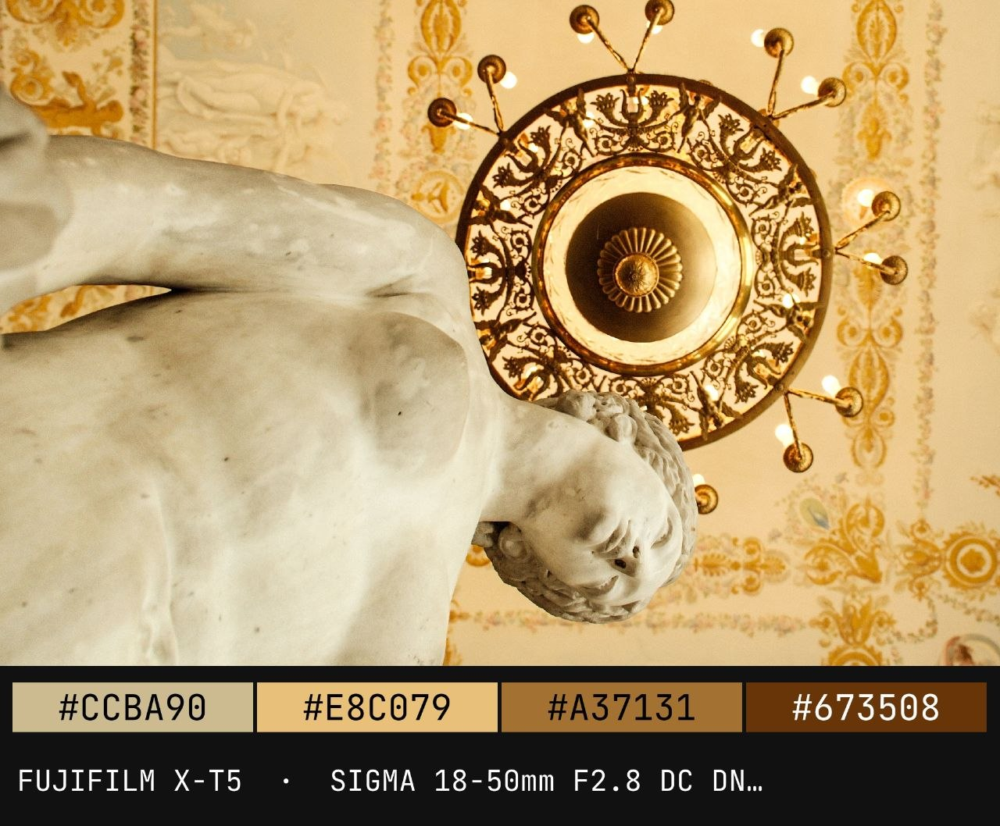
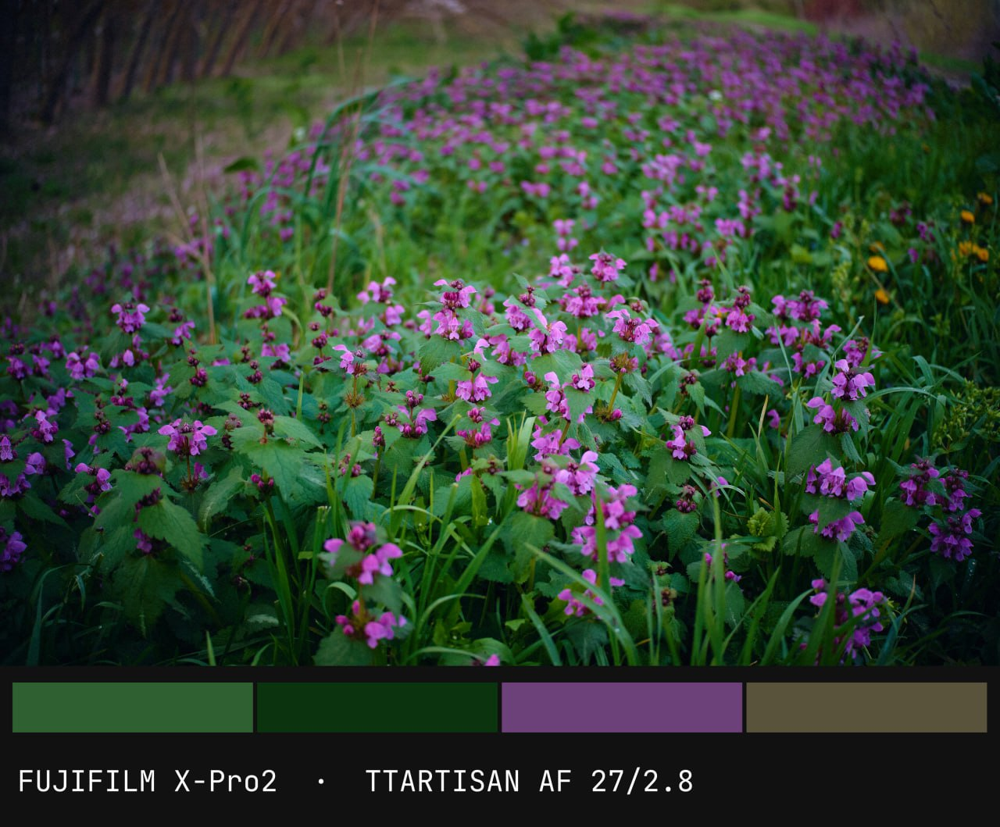
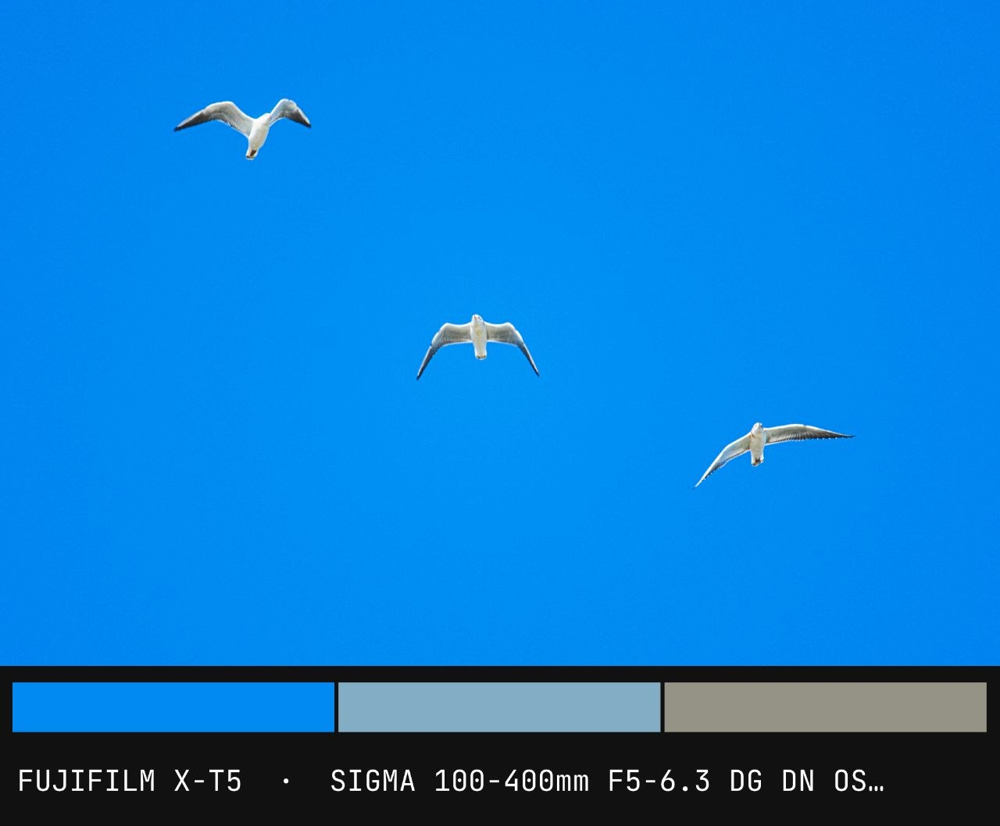

# PhSpectre

Extracts a dominant color palette from a JPEG photo and renders it as a PNG — original image alongside color swatches and optional EXIF metadata.

**Download:** [latest release](https://github.com/CreateLab/PhSpectre/releases/latest) (Windows x64, Linux x64, macOS arm64, Android APK)

[](https://github.com/CreateLab/PhSpectre/actions/workflows/build-windows.yml)
[](https://github.com/CreateLab/PhSpectre/actions/workflows/build-linux.yml)
[](https://github.com/CreateLab/PhSpectre/actions/workflows/build-macos.yml)
[](https://github.com/CreateLab/PhSpectre/actions/workflows/test.yml)

## Screenshots

Desktop app — folder browser, palette settings, and live preview:



Collage mode — check several photos into a tray, generate one palette pooled across all of
them (weighted by displayed area), with EXIF taken from the first photo:

<p>
  
  
</p>

Generated palettes — portrait and landscape layouts, with and without hex labels:

<p>
  
  
</p>
<p>
  
  
</p>
<p>
  
</p>

## Releases

Releases are tagged `vX.Y.Z` (semantic versioning) and each one bundles all four platforms —
`PhSpectre-X.Y.Z-windows-x64.zip`, `PhSpectre-X.Y.Z-linux-x64.tar.gz`,
`PhSpectre-X.Y.Z-macos-arm64.zip` (a proper `.app` bundle), `PhSpectre-X.Y.Z-android.apk` — with an auto-generated
changelog. Grab the latest from the
[Releases page](https://github.com/CreateLab/PhSpectre/releases/latest).

The apps check for a newer release on startup (once a day at most) and show a small,
dismissible notice when one's available — no auto-download/auto-install, it just links to
the release page.

Every commit to `master` still gets a plain build-and-test check on all four platforms
(no version, no release) via the Build/Test workflows above — those aren't installable
releases, just CI signal.

**Cutting a release** (maintainers): `git tag vX.Y.Z && git push origin vX.Y.Z` — CI builds,
versions, and publishes the release automatically.

## Desktop App

Cross-platform GUI built with Avalonia. Open a folder, browse photos, preview the generated palette side-by-side and save it as PNG.

**Collage mode** (desktop and Android) checks several photos into a tray and renders one
card from all of them: photos are laid out into a single image with a configurable gutter,
and the palette is pooled across the source photos — weighted by how much area each one
occupies — so the gutter itself never affects the result. EXIF metadata is read from the
first photo in the tray.

Self-contained — no .NET runtime required on the target machine.

### Keyboard shortcuts

| Key | Action |
|---|---|
| `↑` / `↓` | Navigate file list |
| `Ctrl+S` | Save palette PNG |

## CLI

```bash
dotnet run --project PhSpectre.CLI -- <image.jpg> [options]
```

### Options

| Flag | Default | Description |
|---|---|---|
| `--colors <n>` | auto | Number of palette colors (1–32). Auto uses elbow method (k=3–8). |
| `--no-hex` | — | Hide hex labels on swatches |
| `--theme dark\|light` | `dark` | Dark (`#111111`) or light (`#F5F5F5`) panel background |
| `--no-meta` | — | Suppress EXIF metadata strip |
| `--meta-short` | — | One line: camera · focal · aperture · shutter · ISO |
| `--meta-detail` | — | Two lines: camera+lens / focal+params+date |
| `--meta-full` | — | Three lines: detail + S/N, WB, exposure program, EV |
| `--meta-overlay` | — | Overlay style (semi-transparent) instead of film-strip bar |

Default metadata verbosity (no flag): camera + lens name.

### Examples

```bash
# Auto palette, dark theme, default metadata
dotnet run --project PhSpectre.CLI -- photo.jpg

# 6 colors, light theme, full metadata
dotnet run --project PhSpectre.CLI -- photo.jpg --colors 6 --theme light --meta-full

# Swatches only, no metadata, no hex labels
dotnet run --project PhSpectre.CLI -- photo.jpg --no-meta --no-hex
```

Output is saved as `<original-name>_palette.png` next to the source file. Hex codes and percentages are printed to stdout.

## API

### Run locally

```bash
dotnet run --project PhSpectre.API
# Swagger UI: http://localhost:5000/swagger
```

### Run with Docker

```bash
docker compose up --build
# Swagger UI: http://localhost:8080/swagger
```

### POST /api/palette

```
POST /api/palette
Content-Type: multipart/form-data
```

| Field | Type | Required | Description |
|---|---|---|---|
| `file` | JPEG file | yes | Source photo (`.jpg` / `.jpeg`) |
| `colors` | int | no | Palette size 1–32. Omit for auto. |
| `theme` | `dark` \| `light` | no | Panel background. Default: `dark`. |

Returns the palette PNG as `application/octet-stream`.

```bash
curl -X POST http://localhost:8080/api/palette \
  -F "file=@photo.jpg" \
  -F "colors=6" \
  -F "theme=light" \
  --output palette.png
```

**Rate limit:** 10 requests per minute per IP. Exceeding returns `429 Too Many Requests`.

## Layout

- **Portrait** (height > width): swatches panel on the right, metadata strip below the photo
- **Landscape** (width ≥ height): metadata strip between photo and swatch panel at the bottom

## How it works

1. **Sampling** — resizes the image to 150×150 for fast processing
2. **Clustering** — k-means++ in HSL space with circular hue distance; automatic k via the elbow method if `--colors` is not set
3. **Rendering** — composites the original photo (full resolution, auto-oriented) with the palette panel using SixLabors.ImageSharp

## Requirements

- .NET 8
- Docker (optional, for containerised API)
- Supports JPEG input only (`.jpg` / `.jpeg`)
